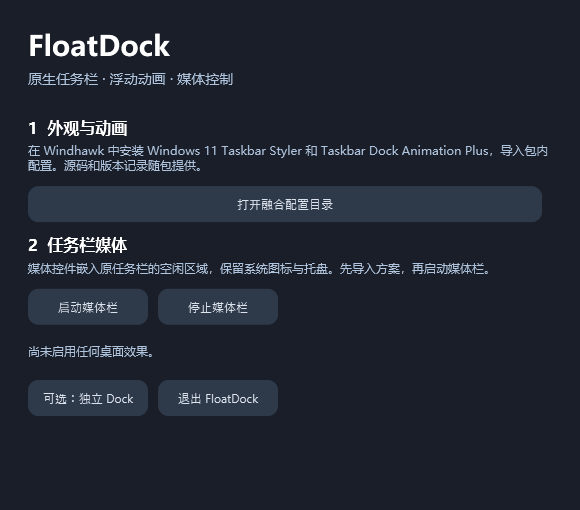
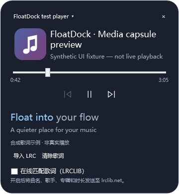

# FloatDock

**Windows 原生任务栏浮动样式、图标动画与媒体控制的融合实验。**

[](https://github.com/guofudamo2007-lab/FloatDock/actions/workflows/build.yml)
[](LICENSE)

v0.3 改用原生任务栏方案：Windhawk 管理系统任务栏的圆角浮动样式与图标动画，FloatDock 将媒体控件嵌入原任务栏空闲位置。默认打开有明确启动、停止和退出按钮的控制窗口；原来的独立 Dock 作为可选模式保留。

**当前是预览版。编译、核心算法和离线 WPF 布局检查已通过；本轮没有在开发者正在使用的桌面启用效果，原生挂载、DPI、裁剪和组合观感尚未实机验收。**

## 实际融合了什么

| 来源 | 本项目的使用方式 |
| --- | --- |
| [Windows 11 Taskbar Styler](https://github.com/ramensoftware/windhawk-mods/blob/main/mods/windows-11-taskbar-styler.wh.cpp) | 随包提供固定版本完整源码；DockLike 主题配合本项目浮动间距、圆角配置 |
| [Taskbar Dock Animation Plus](https://github.com/ramensoftware/windhawk-mods/blob/main/mods/taskbar-dock-animation-plus.wh.cpp) | 随包提供完整原生动画模块和配置；余弦放大、居中邻居位移算法也移植到独立 Dock |
| [AF Media Bar](https://github.com/Fervent-Tempo/AF-Media-Bar) | 移植任务栏子窗口挂载、空闲范围和稳定可见性策略，接入 FloatDock 的媒体控件 |

来源、固定提交和许可证详见 [THIRD-PARTY-NOTICES.md](THIRD-PARTY-NOTICES.md) 与 [PINNED-SOURCES.json](integrations/windhawk/PINNED-SOURCES.json)。不是直接复刻整个 AF Media Bar；音频设备切换、每应用音量和频谱尚未包含。

## 使用原生融合模式

需要 **Windows 11 x64**、**.NET 10 Desktop Runtime** 和 **Windhawk**。分发包必须完整解压。

1. 在 Windhawk 安装 **Windows 11 Taskbar Styler** 和 **Taskbar Dock Animation Plus**。
2. 分别导入包内 `integrations/windhawk/taskbar-styler.yaml` 和 `dock-animation.yaml`。步骤见[融合配置说明](integrations/windhawk/README.md)。
3. 打开 `FloatDock.exe`，点击 **启动媒体栏**。它会查找原任务栏的空白处，不创建第二排应用图标。
4. 点 **停止媒体栏**、媒体条上的 **×**，或 **退出 FloatDock** 关闭媒体组件。

**Windhawk 样式/动画独立运行。退出 FloatDock 不会关闭它们；在 Windhawk 禁用上述两个模块即可移除对应效果。** 本程序不自动安装或启用模块，也不配置开机启动。



上图来自真实 WPF 控件的离线渲染，不是任务栏实机截图。

## 媒体功能

- 封面、曲名/同步歌词；悬停显示上一首、播放暂停、下一首。
- 点击展开卡片，切换媒体来源、拖动进度；播放器未支持的操作会禁用。
- 本地 LRC 按行同步；增强 LRC 按文件提供的词时间高亮。
- 在线 LRCLIB 匹配默认关闭。主动勾选后发送曲名、歌手、专辑和时长；关闭后停止后续请求。
- 任务栏空间不足、位置变化或探测结果不可靠时隐藏媒体条；任务栏隐藏时关闭展开面板。



原生媒体宿主目前只处理主屏横向任务栏。UI Automation 不能证明覆盖所有系统控件或第三方插件；兼容性仍需独立测试。

## 可选独立 Dock

控制窗口的 **可选：独立 Dock**，或显式命令行 `FloatDock.exe --standalone`，会进入独立模式。此模式提供真实应用图标、固定/切换/多窗口轮换、悬停上浮、邻居位移、启动回弹、开始菜单、时钟、设置和退出。

此模式默认临时打开系统任务栏自动隐藏，并为最大化窗口预留底部区域。右端 **退出**、**Ctrl+Alt+Q** 或关闭控制窗口会结束 Dock 并恢复其接管的任务栏状态。快捷键被占用时请使用可见按钮。独立恢复进程处理异常终止；未完成恢复保留记录，下一次主动进入独立模式会尝试恢复。

包内 `restore-taskbar.cmd` / `FloatDock.exe --restore-taskbar` 用于关闭接管中的 Dock 并恢复记录中的状态；没有恢复记录时不改系统设置。它不负责 Windhawk。独立模式不提供系统托盘、窗口缩略图或 Jump List；原生模式仍使用 Windows 原有这些功能。

## 开发与验证

需要 .NET 10 SDK。以下默认检查不会显示窗口或修改任务栏：

```powershell
dotnet build FloatDock.slnx -c Release
dotnet run --project tests/FloatDock.Core.Tests -c Release --no-build
dotnet run --project tests/FloatDock.Windows.Tests -c Release --no-build -- --offline
powershell -File scripts/package.ps1
```

打包脚本只编译、复制文件并创建应用/对应源码 ZIP，不启动应用。构建包依赖 .NET 10 Desktop Runtime，保留整个解压目录。

桌面集成测试必须在专门测试桌面显式选择：WPF 测试要求 `--desktop`；任务栏测试脚本要求 `-AllowDesktopChanges`。它们不属于默认 CI。已有旧版桌面检查结果不能替代 v0.3 原生融合验收。

配置保存在 `%LOCALAPPDATA%\FloatDock\settings.json`。无遥测。Windows 10 1809+ 仅保留独立 Dock 的代码目标，不支持本包的 Windows 11 Styler 外观方案。

## 许可证

融合后的 FloatDock 应用使用 **GPL-3.0-or-later**，保留历史 FloatDock MIT 权利与所有上游署名。Windhawk 模块各自保持上游许可证。特别是 AF 的任务栏挂载代码标注源自 GPL 的 FluentFlyout，不能仅依据 AF 根目录 MIT 声明分发。